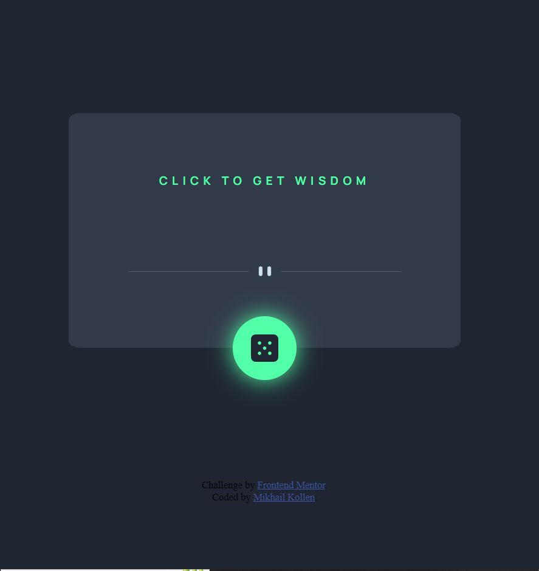

This is a solution to the [Advice generator app challenge on Frontend Mentor](https://www.frontendmentor.io/challenges/advice-generator-app-QdUG-13db).

## Table of contents

- [Overview](#overview)
  - [The challenge](#the-challenge)
  - [Screenshot](#screenshot)
  - [Links](#links)
- [My process](#my-process)
  - [Built with](#built-with)
  - [What I learned](#what-i-learned)
  - [Continued development](#continued-development)
  - [Useful resources](#useful-resources)
- [Author](#author)
- [Acknowledgments](#acknowledgments)

## Overview

### The challenge

Users should be able to:

- View the optimal layout for the app depending on their device's screen size
- See hover states for all interactive elements on the page
- Generate a new piece of advice by clicking the dice icon

### Screenshot



### Links

[Live Site URL:](https://your-live-site-url.com)

## My process

### Built with

- Semantic HTML5 markup
- CSS custom properties
- Flexbox
- JavaScript

### What I learned

During the project I had a chance to polish my recently acquired skills of using APIs. I had to find a suitable solution when dealing with a case of multiple requests coming from the client, so I decided to set up a SetTimeout function to optimize and stabilize the application. It let the request be fetched properly, before a new request could be sent.

```js
btn.addEventListener("click", () => {
  advice.textContent = "Loading wisdom...";
  setTimeout(fetchAdvice, 2000);
});
```

I ran into a problem of making the button round, as the element was not square, and it caused the button becoming not round, but elliptic, so it took me some time to figure out how to deal with the issue. In this case, I decided to set up a fixed height and width for the image and the button, making the element a square.

```css
.random-btn {
  height: 70px;
  width: 70px;
  background-color: hsl(150, 100%, 66%);
  padding: 20px;
  border: none;
  border-radius: 50%;
  transition-duration: 0.5s;
}

.random-btn img {
  height: 30px;
  width: 30px;
}
```

### Continued development

I still find it confusing to use CSS Flexbox and Grid, so I believe that I should focus on these tools more in my later projects.
Although I feel that my layouts have become cleaner, I could definitely benefit from applying some more suitable techniques when building web applications.

### Useful resources

- [MDN](https://developer.mozilla.org/en-US/docs/Web/CSS/position#:~:text=An%20absolutely%20positioned%20element%20is,which%20the%20element%20is%20positioned.) - This article on position helped me to fix the button at the border of the div container.
- [SDR](https://superdevresources.com/css-button-glow-effect/#:~:text=In%20order%20to%20have%20this,from%20the%20glow%2Dbutton%20definition.) - The article contains a nice explanation on setting a box-shadow.

## Author

- My GitHub - [Mikhail Kollen](https://github.com/mikhailkollen)
- Frontend Mentor - [@mikhailkollen](https://www.frontendmentor.io/profile/mikhailkollen)
- Instagram - [@mishakollen](https://www.instagram.com/mishakollen/)

## Acknowledgments

This project was very similar to the one I built when taking the course by John Smilga, so it was not that hard to build the JS part of the application after it. The course that I took:
https://www.udemy.com/course/javascript-tutorial-for-beginners-w/
